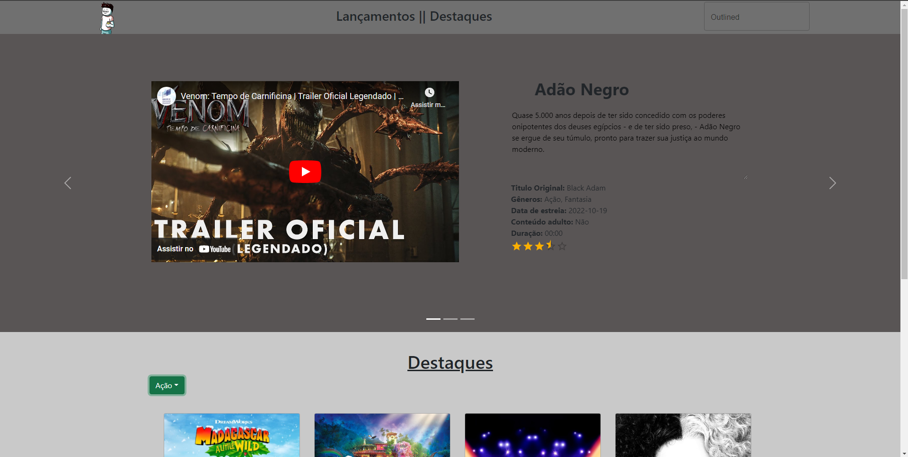
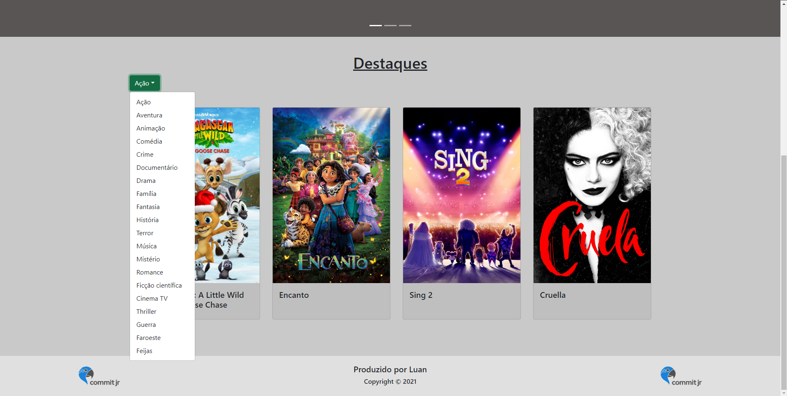

# O MVP da CommitJr foi feito um template básico do que seria um site de filmes, foi consumido API's do site TheMovieDatabase e utilizado no FrontEnd para montar o site.
Primeiro site que fiz (sim, foi o que deu na época) :)
 

